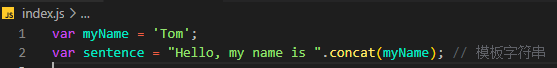

# 布尔值

- 使用 `boolean` 定义布尔值类型

```typescript
const isDone: boolean = false;
console.log(typeof isDone); // boolean
```

> **注意：使用构造函数 `Boolean()` 创造的对象不是布尔值，而是一个 `Boolean` 对象**

```typescript
const isDone: boolean = new Boolean(false); // 编译不通过
```


```typescript
const isDone: Boolean = new Boolean(false); 
console.log(typeof isDone); // object
```

- 直接调用 `Boolean` 返回一个 `boolean` 类型

```typescript
const isDone: boolean = Boolean(false);
console.log(typeof isDone); // boolean
```

# 数值

- 使用 `number` 定义数值类型

```typescript
const num: number = 6;
const hexNum: number = 0xf00d; // 十六进制表示
const binaryNum: number = 0b1010; // 二进制表示
const octNum: number = 0o744; // 八进制表示
const notNum: number = NaN;
const infinityNum: number = Infinity;
```

- 编译结果如下


# 字符串

- 使用 `string` 定义字符串类型

```typescript
const myName: string = 'Tom';
const sentence: string = `Hello, my name is ${myName}`// 模板字符串
```

- 编译结果如下



> **使用 `stirng` 和 `String` 进行类型注解，有什么不同？**

```typescript
let name:string = 'tony'

let name:String = 'tony'
```

- `stirng` 是 `typescript` 中标准的原生字符串类型
- `String` 是 `JavaScript` 中的包装字符串的对象类型

# Null 和 Undefined

- 使用 `null` 和 `undefined` 来定义这两个原始数据类型

```typescript
let udf: undefined = undefined;
let nl: null = null;
```

> **与 `void` 的区别(非严格模式下)**

- `undefined` 和 `null` 是所有类型的子类型，可以赋值给其他类型的变量
- `void` 类型的变量不能赋值给其他类型的变量

```typescript
let udf: undefined;
let num: number = udf; // 编译通过

let vd: void
let str: string = vd; // 编译不通过
```

# 对象类型(接口)

- 在 `TypeScript` 中一般**使用接口（Interfaces）来定义对象类型**

> **接口的概念**

- 接口是**对行为的抽象**，具体行动需要类实现
- 定义一个**类的结构**，或是当成类型声明，**用于描述对象的形状**

## 基本定义

- 定义一个接口 `Person`，声明一个类型为 `Person` 的变量 `p`，约束变量`p` 必须和接口 `Person` 一致

```typescript
interface Person {
  name: string;
  age: number;
}

let p: Person = {
  name:'Jay',
  age:23
}
```

- 定义的变量比接口多或少一些属性编译不能通过


> **注意：赋值的时候，变量的形状必须和接口的形状保持一致**

## 可选属性

- 希望**不要完全匹配一个形状**则用可选属性，表示该属性可以不存在

```typescript
interface Person {
  name: string;
  age?: number;
}

let p1:Person = {
  name:'Jay',
}

let p2:Person = {
  name:'Jay',
  age:23,
}
```

- 但**仍不允许添加未定义的属性**


## 任意属性

- 使用 `[propName: string]` 定义属性为 `string` 类型的接口

```typescript
interface Person {
  [propName: string]: string;
}

let p1:Person = {
  name: 'Jay',
  sex: 'man'
}
```

> **`[prop: string]: string` 的含义**

- `[prop: string]` 指的是对象的键都是字符串
- `string` 表示属性值的类型为字符串类型

> **同时定义任意属性和其他类型的属性**

- 一个接口也可以**同时存在任意属性和其他属性**

```typescript
interface Person {
  username: string;
  [key: string]: string;
}
```

- **特定的规则要求：**如果一个属性的类型是 `number`，那么其值类型必须是另一个属性的值类型的子集，该规则目的是确保类型系统的安全性

```typescript
interface MyObject {
  [key: string]: number;
  stringValue: string; // 类型“string”的属性“stringValue”不能赋给“string”索引类型“number”
}

const obj: MyObject = {
  stringValue: 'Hello',
  numberValue: 42
};

const value: number = obj['stringValue']; // 错误，值类型不是 number 的子集
```

## 只读属性

- 希望对象中的一些属性只能在创建的时候被赋值，那么可以用 `readonly` 定义

```typescript
interface Person {
  readonly id: number;
}
```

- 如果用 `readonly` 修饰的 `id` 被修改，编译不会通过

```typescript
interface Person {
  readonly id: number;
  name: string;
}

let p1:Person = { 
  id: 1999,
  name: 'Jay'
}

p1.id = 2000  // 给只读属性赋值，编译不通过
```


# 数组类型

- 数组类型有多种定义方式，比较灵活

## 类型 + 方括号

- 最简单的方法是**使用「类型 + 方括号」来表示数组**

```typescript
let numList: number[] = [1, 2, 3, 4]; // 只能包含number类型
let strList: string[] = ['a','b','c','d'] // 只能包含string类型
```

- 数组的项中**不允许**出现其他的类型


- 数组方法的参数也会根据数组在定义时的类型进行限制


## 数组泛型

- 使用数组泛型（Array Generic） `Array<elemType>` 来表示数组

```typescript
let numList: Array<number> = [1, 2, 3, 4]; 
let strList: Array<string> = ['a','b','c','d'] 
```

## 接口数组

- 接口定义时**用 `number` 类型的签名**即可表述数组

```typescript
interface NumberArray {
    [index: number]: number;
}
let arr1: NumberArray = [1, 2, 3, 4]; 
let arr2: NumberArray = [1, 2, 3, 4,'5']; // 编译不通过
```

- 虽然接口可以定义数组，但是一般不这么做，不过它**常用来表示类数组**
- 类数组都有自己的接口定义，如 `IArguments`，`NodeList`，`HTMLCollection`
- 其中 `IArguments` 是内置定义的接口

```typescript
interface IArguments {   
  [index: number]: number;
  length: number;
  callee: Function;
}

function sum() {
  let args: IArguments = arguments;
}
```

## any数组

- 可以用 `any` 表示**数组中允许出现任意类型**

```typescript
let recordList: any[] = ['typeScript', 23, { website: 'http://www.baidu.com' },false];
```

# 函数类型

- 函数在 `JavaScript` 中是一等公民

## 函数声明

- 一个函数有输入和输出，要在 `TypeScript` 中对其进行约束，则需要把输入和输出都考虑
- 下面代码中表示，函数 `sum` 需要接收两个 `number` 类型的参数，并返回 `number` 类型的值结果

```typescript
function sum(x: number, y: number): number {
  return x + y;
}
```

- 注意，**参数过多或少，参数类型不正确，是不能编译通过的**

```typescript
sum(1,2) // 3
sum(1,2,3) // 参数过多
sum(1) // 参数过少
sum('1',2) // 参数类型错误
```

## 函数表达式

- 使用函数表达式定义，则需要对等号两边都进行类型限制

```typescript
let sum: (x: number, y: number) => number = (x: number,y: number): number => x + y 
console.log(sum(1,2)); // 3
```

- 上面代码中，等号**右边对函数的输入输出进行类型定义**，而对等号**左边的赋值操作进行类型限制**
- `typescript` 的类型定义中，`=>` 表示函数的定义，左右两边为输入输出的类型

## 接口定义函数

- 使用接口的方式来**定义一个函数需要符合的形状**

```typescript
interface ISum {
  (x: number,y: number): number
}

let sum: ISum = (x: number,y: number): number => x + y 
console.log(sum(1,2)); // 3
```

- 采用接口 / 表达式定义函数，**对等号左侧进行类型限制**，保证赋值时参数个数、类型、返回值类型不变

## 可选参数

- 与接口中的可选属性类似，**用 `?` 表示可选的参数**

```typescript
interface ISum {
  (x: number,y: number,z?: number): number
}
let sum: ISum = (x: number,y: number,z?: number): number => {
  return z ? x + y + z : x + y;
}

console.log(sum(1,2)); // 3
console.log(sum(1,2,3)); // 6
```

- **注意：可选参数后面不允许出现必需参数**


## 参数默认值

- `TypeScript` 中给函数**参数添加的默认值会被识别为可选参数**

```typescript
function sum (x: number, y: number, z: number = 2): number {
  return x + y + z;
}

console.log(sum(1,2)); // 5
console.log(sum(1,2,3)); // 6
```

- 使用参数默认值后，参数的位置不受限制，但是**参数的个数会受到限制**

```typescript
function sum (z: number = 2,x: number,y: number): number {
  return x + y + z;
  
console.log(sum(2,1,2)); // 5(必须传递3个参数)
console.log(sum(1,2,3)); // 6
```

## 剩余参数

- 使用 `...rest` 的方式获取函数中的剩余参数，可以使用数组类型定义 `rest`

```typescript
function sum (...rest: any[]): number {
  return rest.reduce((i, j) => i + j, 0)
}

console.log(sum(2,1,2)); // 5
console.log(sum(1,2,3)); // 6
```

> **注意：`rest` 参数只能是最后一个参数**

## 函数重载

- **作用：**实现**不同参数输入并且对应不同参数输出的函数**
- **实现：**函数重载分为两部分，**多个重载体(函数声明)**和**一个实现体(函数实现)**
- **含义：**名称相同，参数不同的几个函数，称为函数的重载

> **函数重载的组成部分**

- **重载体(函数声明)：**精确显示函数的输入输出
- **实现体(函数实现)：**将所有的输入输出类型做一个全量定义，并实现具体逻辑

> **实现一个 `add` 函数，当传入 `number` 时返回 `number`，当输入 `string` 时返回 `string`**

```typescript
function add(num1:number,num2:number):number;
function add(num1:string,num2:string):string;
function add(num1:any,num2:any):any{
  return num1 + num2
}
```

- 当传入不同类型的参数时，`typescript` 会**找到对应的重载体，然后执行唯一的实现体**


- 在函数重载中，当传入参数的类型匹配不到相应的重载体时，也不能直接调用函数实现体

```typescript
const objRes = add({name: 'tony'}, {age: 18}) // 编译不通过
```