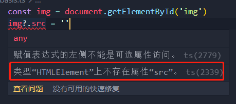
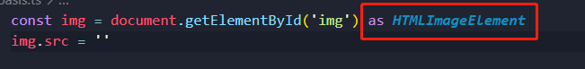
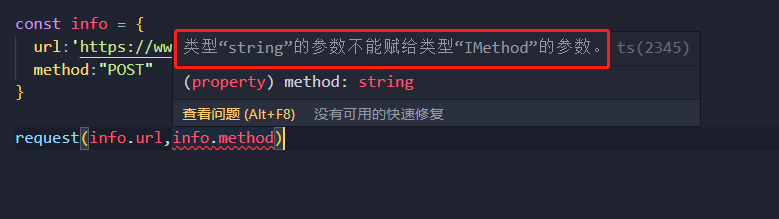

# 类型断言

- **作用：**类型断言可以用来**手动指定一个值的类型**

- **语法：**`值 as 类型`

- **解决场景：**有时候 `TypeScript` 无法获取具体的类型信息，此时需要使用类型断言(`Type Assertions`)

  - 比如通过 `document.getElementById`，`TypeScript` 只知道该方法会返回 `HTMLElement|null`，但并不知道它具体的类型，此时需要类型断言确定是哪一种 `dom` 元素

  

  - 使用类型断言解决

  

## 类型断言用途

- 类型断言的常见用途有以下几种：

> **①将一个联合类型断言为其中一个类型**

- 当 `TypeScript` 不确定联合类型变量的类型时，**只能访问此联合类型共有的属性或方法**
- 在不确定类型时，**访问其中一个类型特有的属性或方法可以使用类型断言**

```typescript
interface Dog {
  name: string;
  run(): void;
}
interface Bird {
  name: string;
  fly(): void;
}

function doSoming(animal: Dog | Bird) {
  (animal as Bird).fly(); // 断言为Bird类型，调用其fly方法
}

const niao: Bird = {
  name: 'Tom',
  fly() { console.log('fly') }
};

doSoming(niao)
```

- **注意：**类型断言**只能够欺骗编译器**，**无法避免运行时的错误**，如下所示

```typescript
class Person {}

class Student extends Person{
  study(){
    console.log('study');
  }
}

function doSoming(person: Person) {
  (person as Student).study(); // 断言为Student类型，欺骗编辑器
}

const p = new Person()
doSoming(p) // person.fly is not a function
```

- **总结：**尽量**避免断言后调用方法或引用深层属性**，以减少不必要的运行时错误

> **②将父类断言为更加具体的子类**

- **例如：**以下函数的参数类型是比较抽象的父类 `Error`，但父类 `Error` 中没有 `code` 属性，故直接获取 `error.code` 会报错，需要使用类型断言为更具体的子类

```typescript
interface ApiError extends Error {
  code: number;
}
interface HttpError extends Error {
  statusCode: number;
}

function isApiError(error: Error) {
  if (typeof (error as ApiError).code === 'number') {
      return true;
  }
  return false;
}
```

> **③将任何类型断言为 `any`**

- 有时候开发者很确定这段代码不会出错，如下所示：

```typescript
window.num = 23 // 类型“Window & typeof globalThis”上不存在属性“num”。
```

- 此时可以使用 `as any` 临时将 `window` 断言为 `any`，因为 `any` 类型的变量访问任何属性都是允许的

```typescript
(window as any).num = 23
```

- **注意：**将一个变量断言为 `any` 可以说是**解决 `TypeScript` 中类型问题的最后一个手段**，**它极有可能掩盖了真正的类型错误，尽量避免使用 `as any`**
- **总结：**不能滥用 `as any`，要**在类型严格性和开发便利性之间掌握平衡**

> **④将 `any` 断言为一个具体的类型**

- 在日常开发中总是需要处理 `any` 类型的变量，例如下述情况：
  - 第三方库未定义好自己的类型
  - `TypeScript` 类型系统的限制而无法准确定义
  - 他人遗留的代码

- 可以通**过类型断言把 `any` 断言为精确的类型**
- **示例：**代码中有个 `getData函数`，返回值是 `any`，在使用时最好能将返回值断言成精确的类型

```typescript
const getData:()=>any= ()=>{
  return 1234
}

const res = getData() as number
console.log(res.length); // 类型“number”上不存在属性“length”
```

> **⑤将任何类型先断言为 `any/unknown`，再重新断言为具体类型**

- `any`和`unknown`可以看做是所有类型的超类，作为变量的时候接受任何类型的值
  - `any` 作为值可以分配给任何类型，`unknown` 只能分配给 `any`
- 于是可以有以下写法：
  - 任何类型 `as unknown as` 任何类型
  - 任何类型 `as any as` 任何类型 

```typescript
const message = 'Hello World'

const num:number = message as unknown as number
```

- **注意：**尽量避免这种情况，**以免造成类型混乱**

## 类型断言的限制

- 并不是所有的类型之间都可以进行类型断言，**前提是两个类型之间要有(父子/超子)类型关系** ，详细的来说可以分为一下两种情况：

> **安全的双向推断**

- 如果两个类型互相兼容，即 `A` 兼容 `B`，`B` 也兼容 `A`，那么 `A` 能够被断言为 `B`，`B` 也能被断言为 `A` 
- 此时**任意一个断言方向都可以被称之为安全的双向推断**

> **不安全的类型窄化** / **安全的类型泛化**

- 若 `A` 兼容 `B`，但是 `B` 不兼容 `A`，此情况下 `A` 也能够被断言为 `B`，`B` 也能被断言为 `A`
  - **将 `A` 断言为 `B` 则称之为不安全的类型窄化**(如将父类断言为更具体的子类)
  - **将 `B` 断言为 `A`，称之为安全的类型泛化**(如将子类被断言为父类)

-  实际上 `TypeScript` 在判断类型的兼容性时，比这种情况复杂很多，下面是官方给出的类型兼容性关系表

| 值\变量     | any   | unknown | object | void  | undefined | null  | never |
| ----------- | ----- | ------- | ------ | ----- | --------- | ----- | ----- |
| any →       |       | **✓**   | **✓**  | **✓** | **✓**     | **✓** | ✕     |
| unknown →   | **✓** |         | ✕      | ✕     | ✕         | ✕     | ✕     |
| object →    | **✓** | **✓**   |        | ✕     | ✕         | ✕     | ✕     |
| void →      | **✓** | **✓**   | ✕      |       | ✕         | ✕     | ✕     |
| undefined → | **✓** | **✓**   | **—**  | **✓** |           | **—** | ✕     |
| null →      | **✓** | **✓**   | **—**  | **—** | **—**     |       | ✕     |
| never →     | **✓** | **✓**   | **✓**  | **✓** | **✓**     | **✓** |       |

- **列**表示变量的类型，**行**表示要分配给变量的值。 “`—`”表示仅在`--strictNullChecks`关闭时才兼容的类型 

- **总结：**要使得 `A` 能够被断言为 `B`，只需要 `A` 兼容 `B` 或 `B` 兼容 `A` 即可 

## 非空类型断言

- 调用带可选参数的函数时，若在函数内部访问了参数中的属性或方法，此时不传参数会造成访问 `undefined` 上的属性或方法，如下所示

```typescript
const printStringLength = (str?:string)=>{
  console.log(str.length); // 对象可能为“未定义”
}
```

- 此时需要使用类型断言，断定该参数不为空

```typescript
const printStringLength = (str?:string)=>{
  console.log(str!.length);
}
```

- **注意：**此时使用非空类型断言只能欺骗编译器，最好做法是判断 `str` 是否存在

```typescript
const printStringLength = (str?:string)=>{
  if(!str) return console.log(0);
  console.log(str.length);
}
```

## 字面量推理

- 如下代码所示

```typescript
type IMethod = 'GET'|'POST'|'PUT';
const request = (url:string,method:IMethod)=>{
  console.log(url);
  console.log(method);
}

const info = {
  url:'https://www.baidu.com/',
  method:"POST"
}
request(info.url,info.method)
```

- 由于没有对变量 `info` 作类型注解，则会自动推断 `info` 中的 `method` 为 `string` 类型
- 在调用 `request` 方法时，编译会出错



- 此时可以使用 `as const` 语法，让 `info` 中的属性成为只读的，这样就可以让其类型推导为字面量

```javascript
const info = {
  url:'https://www.baidu.com/',
  method:"POST"
} as const
```

- **总结：** `as const` 修饰符可以用于修改**对象/数组字面量**的类型推断，强制 `TypeScript` 将**对象/数组字面量**的类型推断为只读的

## 其他写法

- 类型断言除了使用 `as` 关键字，还可以使用 `<类型>`

```typescript
const img = document.getElementById('img') as HTMLImageElement

const img = <HTMLImageElement>document.getElementById('img')

// 以上两种写法等同
```

# 类型守卫

- **类型守卫是返回布尔值的常规函数，用于获取变量类型信息**，通常使用在条件块语句中，接受一个类型并告诉 `TypeScript` 是否可以缩小到更具体的类型
- **类型守卫具有唯一的属性**，能在特定的上下文中推断出变量的特定类型，确保参数类型与指定的一致
- 常见的类型守卫如下

> **① `typeof` 关键字**

-  `typeof` 用于确定变量的类型，但只能确定 `boolean`、`string`、`bigint`、`symbol`、`undefined`、`function`、`number`，其他都判断为 `object`

```typescript
type IDType = string | number;

const printID = (id:IDType) => {
  if (typeof id === 'string') {
    console.log(id.toUpperCase());
  }else{
    console.log(id);
  }
}
```

> **②`instanceof` 关键字**

-  `Instanceof`是一个**内置类型守卫，用于检查一个值是否是给定构造函数或类的实例**

```typescript
type TimeType = string | Date;
const printTime = (time:TimeType) => {
  if(time instanceof Date){
    console.log(time.toUTCString());
  }
}
```

> **③`in`关键字**

- `in` 类型守卫**检查对象是否具有特定的属性，并使用该属性区分不同的类型**
- `in` 类型守卫通常**返回一个布尔值，表示该属性是否存在于该对象中**

```typescript
type Fish = {
  swim: () => void
}
type Bird = {
  fly: () => void
}


const doSomthing = (animal: Fish | Bird) => {
  if('swim' in animal){
    animal.swim()
  }
}
```

> **④等式收缩式守卫**

- 等式收缩守卫**检查表达式的值**，为了使两个变量相等，两个变量必须是同一类型
- 等式收缩式守卫相当于 `Typescript` 使用已知变量提供的信息来缩小变量的类型

```typescript
type IAlign = 'left' | 'right' | 'center';

const printAlign = (align:IAlign) => {
  if(align==='left'){
    console.log(align); // (parameter) align: "left"
  }
} 
```