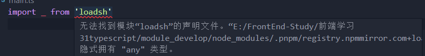

# 命名空间

- `TypeScript` 支持两种方式来控制我们的作用域：
  - **模块化：**每个文件可以是一个独立的模块，支持 `ES Module`，也支持 `CommonJS`
  - **命名空间：**通过 `namespace` 来声明一个命名空间，在 `TypeScript` 早期时，称之为内部模块，主要目的是**将一个模块内部进行作用域的划分，防止一些命名冲突**

- 命名空间的基本使用，首先进行声明

```typescript
// utils/format.ts
export namespace time {
  export const format = (time: string) => {
    return '2023-02-22'
  }
}

export namespace price {
  export const format = (price: string) => {
    return '99.99'
  }
}
```

- 然后引入使用

```javascript
import { time } from './utils/format'

time.format('20230222');
```

# 命名冲突

- 对于 `.ts` 文件来说，如果没有顶级导入或导出声明，该文件被视为其内容在全局范围内可用的脚本

```typescript
// a.ts
let name:string = 'gogo'
```

```typescript
// b.ts
let name:string = 'tony'
```

- 以上情况会造成命名冲突，使用 `export {}` 语句作为模块进行空导出，表明是 `ES` 模块，有自己的作用域

```typescript
// b.ts
let name:string = 'tony'
export {}
```


# 类型的查找

- 在 `TypeScript` 中有一种以 `.d.ts` 结尾的文件，一般用于做类型的声明(declare)，它仅仅用来做类型检测，告知 `typescript` 有什么类型

> **`typescript` 会在以下三个地方查找类型声明**

- **内置类型声明：**`typescript` 自带的，内置了 `JavaScript` 运行时一些标准化 `API` 的声明文件，包括 `Math`、`Date`、`Window`、`Document` 等

  - 链接：https://github.com/microsoft/TypeScript/blob/main/tests/lib/lib.d.ts

- **外部定义类型声明：**通常是使用一些第三方库时需要的类型声明，这些库有两种类型声明方式

  - 在自己库中进行类型声明，如 `axios`
  - 通过社区的一个公有库 `DefinitelyTyped` 存放类型声明文件，可以通过 `npm` 安装

  ```shell
  # 安装loadsh声明文件
  npm install @types/loadsh --save-dev
  ```

- **自定义类型声明：**在项目中自定义一个声明文件，编辑器会自动扫描该类型文件，声明文件必需以 `.d.ts` 为后缀

  - 例如在使用第三方库 `loadsh` 时，在 `typescript` 中，编译器不知道 `loadsh` 是什么

  

  -  这时需要新建一个 `loadsh.d.ts` 文件，使用 `declare` 来定义它的类型

  ```typescript
  declare module 'loadsh' {}
  ```