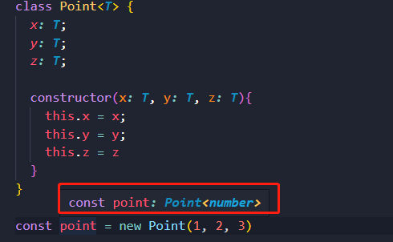

# 泛型的基本概念

- 泛型(Generics)是指在定义函数、接口或类的时候**，不预先指定具体的类型，而在使用的时候再指定类型的一种特性**
- **场景：**在定义函数时不决定参数类型，而是在调用函数时明确所需的类型
- **例如：**封装一个函数，传入一个参数并将其返回，要求返回值类型须和参数一致

```typescript
const foo = <T>(arg: T): T => {
  return arg
}

foo<number>(20)
foo<string>('abc')
foo<string[]>(['abc'])
foo<{name: string}>({name: 'Tony'})
```

- 虽然上面代码可以使用 `any` 实现，但是丢失了类型信息

- 当不传入类型时会自动进行类型推导，但推导的是字面量类型


# 多个类型参数

-  定义泛型的时候，可以一次定义多个类型参数 

```typescript
const foo = <T, U>(arg1: T, arg2: U) => {

}

foo<number, string>(30, 'abc')
```

- 开发中一些常用的泛型名称
  - **T：**类型，`Type` 的缩写
  - **K、V：**键值对，`Key` 和 `Value` 的缩写
  - **E：**元素，`Element` 的缩写
  - **O：**对象，`Object` 的缩写

# 泛型接口

- 可以定义含有泛型的接口，使接口更具备通用性 

```typescript
interface IPerson<N, A> {
  name: N
  age: A
}

const p: IPerson<string, number> = {
  name: 'Tony',
  age: 18
}
```

- **注意：**泛型接口不能进行类型推导，泛型的参数是必须的

```typescript
interface IPerson<N, A> {
  name: N
  age: A
}

const p: IPerson = { // 泛型类型“IPerson<N, A>”需要 2 个类型参数。
  name: 'Tony',
  age: 18
}
```

- 泛型参数可以指定默认类型

```typescript
interface IPerson<N = string, A = number> {
  name: N
  age: A
}

const p: IPerson = {
  name: 'Tony',
  age: 
```

# 泛型类

-  与泛型接口类似，泛型也可以用于类的类型定义中

```typescript
class Point<T> {
  x: T;
  y: T;
  z: T;

  constructor(x: T, y: T, z: T){
    this.x = x;
    this.y = y;
    this.z = z
  }
}

// 两种指定方式
const point1 = new Point<number>(1, 2, 3) 
const point2: Point<string> = new Point('1.23', '2.24', '3.35')
```

- 也可以进行类型推导



# 泛型约束

-  在函数内部使用泛型变量时，因为不知道它是哪种类型，所以不能随意的操作其属性或方法

```typescript
const getLength = <T>(arg: T) => {
  return arg.length  // 类型“T”上不存在属性“length”。
}
```

- 需要对泛型进行约束，只允许这个函数传入那些包含 `length` 属性的变量

```typescript
interface ILength {
  length: number
}

const getLength = <T extends ILength>(arg: T) => {
  return arg.length // 类型“T”上不存在属性“length”。
}

getLength('abcd')
getLength([1, 2, 3])
getLength({length: 18})
getLength(123) // 类型“number”的参数不能赋给类型“ILength”的参数。
```

-  多个类型参数之间也可以互相约束

```typescript
const copyFields = <T extends U, U>(target: T, source: U): T => {
  for (let id in source) {
      target[id] = (source as T)[id];
  }
  return target;
}

let x = { a: 1, b: 2, c: 3 };

copyFields(x, { b: 10 });
```

-  上面代码中要求 `T` 继承 `U`，这样能保证 `U` 上不会出现 `T` 中不存在的字段