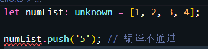

# 任意类型any

- 一个普通类型在赋值过程中是不允许改变类型的

```typescript
let count: number = 1;
count = '1';  // 编译不通过
```


- `any` 类型允许被赋值为任意类型

```typescript
let count: any = 1;
console.log(typeof count); // number

count = '1'
console.log(typeof count); // string
```

- 在任意值上**访问任何属性**

```typescript
let anyThing: any = 'hello';
console.log(anyThing.person); // undefined
console.log(anyThing.person.age); // 编译通过，但运行报错
```

- 声明变量时**既不赋值又不指定类型**，则会**被识别为 `any`**

```typescript
let anyThing; // 等价于let anyThing: any;
anyThing = 7
anyThing = '777'
console.log(anyThing.person); // undefined
```

- `any` 类型可以赋值给任意类型(除 `never`)

```typescript
let anyThing: any = '1';
let num: number = anyThing
console.log(typeof num); // string
```

# 未知类型unknown

- `unknown` 类型允许被赋值为任意类型，相当于一个类型安全的 `any`

```typescript
let uk: unknown = 'hello';
uk = 7
uk = false
```

- 但不能调用属性和方法

```typescript
let numList: unknown = [1, 2, 3, 4];

numList.push('5'); // 编译不通过
```



- 不能将 `unknown` 赋值给除自身和 `any` 之外的类型


> **`any` 对比 `unknown`**

- `any` 可以赋值给任意变量(除 `never`)，`unknown` 只能赋值给 `unknown` 和 `any`
- `any` 可以**访问任意属性和方法**，`unknown` 则不行
- 设置类型为 `any` 相当于对该变量关闭类型检测
- 声明变量时，既不赋值又不指定类型，则为 `any`

# 无值类型never

- 永远不会返回结果
- 总是抛出错误的函数
- 死循环也是 `never` 类型

```typescript
function neverReturn(): never { 
   throw "this will always throw"; 
}
```

- 如果上面函数改为 `return` 就会编译不通过


# 空值类型void

- 用 `void` 表示**没有任何返回值的函数**

```typescript
function logName(): void {
    console.log('My name is zhangsan');
}

logName() // 'My name is zhangsan'
```

- 声明一个 `void` 类型的变量只能将其赋值为 `undefined` ( 非严格模式下可以赋值为 `null`)

```typescript
const unusable: void = undefined;

const number: void = 23; // 编译不通过
```

> **`never` 和 `void` 的区别**

- `void` 表示空值，函数没有返回值（**可以返回，但是没值**）
- `never` 表示无值，函数根本就没返回（或者总是出错，**永远不会有返回值**）

# 枚举类型enum

- **应用：**用于取值**被限定在一定范围内的场景**
- **理解：**枚举就是将一组可能出现的值，一个个列举出来，定义在一个类型中
- 使用 `enum` 关键字定义枚举类型

```typescript
enum Days { Sun, Mon, Tue, Wed, Thu, Fri, Sat };
```

- 枚举成员默认会被赋值为从 0 开始递增的数字，同时也会对枚举值到枚举名进行反向映射

```typescript
enum Days { Sun, Mon, Tue, Wed, Thu, Fri, Sat };

console.log(Days['Sun']); // 0
console.log(Days['Mon']); // 1

console.log(Days[0]); // Sun
console.log(Days[1]); // Mon
```

- 可以通过点形式获取枚举集合中的成员

```typescript
enum Days { Sun, Mon, Tue, Wed, Thu, Fri, Sat };

console.log(Days.Sun); // 0
console.log(Days.Mon); // 1
```

- 枚举编译成 JavaScript 后，每个值都被赋予了对应的数字

```javascript
var Days;
(function (Days) {
    Days[Days["Sun"] = 0] = "Sun";
    Days[Days["Mon"] = 1] = "Mon";
    Days[Days["Tue"] = 2] = "Tue";
    Days[Days["Wed"] = 3] = "Wed";
    Days[Days["Thu"] = 4] = "Thu";
    Days[Days["Fri"] = 5] = "Fri";
    Days[Days["Sat"] = 6] = "Sat";
})(Days || (Days = {}));
```

- TypeScript 中定义的枚举经过编译之后是一个对象

```typescript
{
    0: "Sun",
    1: "Mon",
    2: "Tue",
    3: "Wed",
    4: "Thu",
    5: "Fri",
    6: "Sat",
    Sun: 0,
    Mon: 1,
    Tue: 2,
    Wed: 3,
    Thu: 4,
    Fri: 5,
    Sat: 6,
}
```

## 数字枚举

- 在仅指定常量命名时，定义的枚举集合就是默认从 0 开始递增的数字集合
- 若想要从其他值开始递增，可以指定第一个值的索引值

```typescript
enum Color { Red = 5, Blue, Yellow }

console.log(Color.Red); // 5
console.log(Color.Blue); // 6
console.log(Color.Yellow); // 7
```

- 对某个枚举成员指定索引值**，**该枚举成员后面的成员若没有指定索引值，则依次加一

```typescript
enum Code {
  success = 200,
  allow,
  notAllow = 403,
  fail
}

console.log(Code.allow); // 201
console.log(Code.fail); // 404
```

- 可以给每个枚举成员指定不连续的任意索引值

```typescript
enum Code {
  success = 200,
  cache = 304,
  notAllow = 403,
  ServerError = 502
}

console.log(Code.success); // 200
console.log(Code.cache); // 304
```

- 如果未指定索引的枚举成员与指定索引值的重复了，而后者会覆盖前者

```typescript
enum Days { Sun = 3, Mon = 1, Tue, Wed }

console.log(Days.Sun); // 3
console.log(Days.Wed); // 3
console.log(Days[3]); // Wed
```

- 指定索引的枚举成员也可以为小数或负数，后续未指定的成员递增仍为 1

```typescript
enum Days { Sun = 3, Mon = 1.5, Tue, Wed }

console.log(Days.Sun); // 3
console.log(Days.Mon); // 1.5
console.log(Days.Tue); // 2.5
console.log(Days.Wed); // 3.5
```

- 数字枚举定义值时，可以使用计算值和常量，但该成员后面必须设置初始值**，**不能使用默认的递增值

```typescript
const getValue = () => 2;

enum Index { 
	a = getValue(), // 使用计算值
	b, // 枚举成员必须具有初始化表达式
	c 
}
```


```typescript
const val = 2
enum Index { 
	a = val, // 使用常量
	b, // 枚举成员必须具有初始化表达式
	c
}
```


## 字符串枚举

- 字符串枚举值要求每个成员的值都必须是字符串字面量

```typescript
enum Msg {
  error = 'error',
  success = 'success'
}

console.log(Msg.error); // error
console.log(Msg.success); // success
```

- 也可以是该枚举值中另一个字符串枚举成员

```typescript
enum Msg {
  error = 'error',
  success = 'success',
  ServerError = error
}
console.log(Msg.error); // error
console.log(Msg.success); // success
console.log(Msg.ServerError); // error
```

> **注意：使用其他枚举成员作为值，必须来自同一个枚举，并且字符串枚举不能使用常量或者计算值**

## 异构枚举

- 异构枚举就是枚举成员既有数字类型又有字符串类型

```typescript
enum Res {
  Code = 200,
  Msg = 'success',
}
```

> **注意：开发过程中不建议使用异步枚举，因为一个枚举的特点是相似的**

- 如接口请求返回的状态码都是数值，提示信息都是字符串

- 在使用枚举时尽量避免使用异构枚举，主要是做好类型的整理

## 常量枚举

- 常量枚举会在编译阶段被删除，生成的 JavaScript 不会包含其中，并且不能包含计算成员
- **应用场景：**如果不需要编译成后会生成的对象，可以使用常量枚举
- 使用 `const enum` 关键字定义的枚举类型

```typescript
const enum Status {
  Fail,
  Success
}
const res = Status.Success
```

- 上面代码编译之后如下所示：

```javascript
var res = 1 /* Status.Success */;
```

- 假如包含了计算成员，则会在编译阶段报错


> **常量枚举的优点**

- 能以清晰、结构化的形式维护相关联的常量集合
- 编译后抹除了定义、内联成员值，在代码体积和性能方面并不比直接内联常量值差

## 外部枚举

- 外部枚举是使用 `declare enum` 关键字定义的枚举类型，常出现在声明文件中
- `declare` 关键字定义的枚举类型只会用于编译时的检查，编译结果中会被删除

```typescript
declare enum Directions {
  Up,
  Down,
  Left,
  Right
}
const right = Directions.Right
```

- 编译和的代码如下所示：

```typescript
var right = Directions.Right;
```

- 可以同时使用 `declare` 和  `const` 声明枚举

```typescript
declare const enum Directions {
  Up,
  Down,
  Left,
  Right
}
const right = Directions.Right
```

- 编译结果如下

```typescript
var right = 3 /* Directions.Right */;
```

## 枚举成员类型

- 如果枚举里所有成员都是字面量类型的值，那么每个枚举成员和枚举值本身都可以作为类型来使用

```typescript
enum Animal {
  Dog = 1,
  Cat = 2,
  Rabbit = 3
}

interface Dog {
  type: Animal.Dog
}

const dog:Dog = {
  type: Animal.Dog
}
```

- 如果不符合类型，编译则会出错

```typescript
const dog: Dog = {
  type: Animal.Cat // 不能将类型“Animal.Cat”分配给类型“Animal.Dog”
}
```

## 联合枚举类型

- 一个枚举可作为一个包含所有成员的联合类型

```typescript
enum Status {
  Success,
  Fail
}

interface Res { 
  status: Status // 相当于 status: Status.Success|Status.Fail
} 

const res1: Res = { status: Status.Success }
const res2: Res = { status: Status.Fail }
```

- 若属性值是不是两者其中之一，这会编译失败

```typescript
const res3:Res = { status:'pending' } // 不能将类型string分配给类型Status
```

# 元组tuple

- 数组合并了相同类型的项，而**元组(`Tuple`)合并了不同类型的项**

## 简单使用

- 定义一对值分别为 `string` 和 `number` 的元组

```typescript
let list: [string, number] = ['a', 1]
```

- 元组中**对应类型的值不能调换位置**


- 元组中的项**不能过多或少**

```typescript
let list1: [string, number] = ['a', 1, 2 ] // 元素超出限制
let list2: [string, number, any] = ['a', 1 ] // 元素少于目标
```

- 这么看**元组就像是一个固定大小和元素类型的数组**
- 因为 `TS` 完全兼容 `JS`，所以**元组可以调用数组的方法**，从而突破大小的限制

```typescript
let list1: [string, number] = ['a', 1]
list1.push(1)

console.log(list1); // ['a', 1, 1]
```

- 也可以**对元组进行下标操作**

```typescript
let list1: [string, number] = ['a', 1]

list1[0] = 'JavaScript';
list1[1] = 25

console.log(list1); // ['JavaScript', 25]
```

- 当赋值或访问一个已知索引的元素时，会得到正确的类型

```typescript
let list1:[string, number] = ['JavaScript', 25]

list1[0].slice(1);
list1[1].toFixed(2)

list1[0].pop() // 类型“string”上不存在属性“pop”
```

## 元素越界

- 当添加越界的元素时，被限制为元组中每个类型的联合类型

```typescript
let list1: [string, number] = ['JavaScript', 25]

list1.push(true)
```


