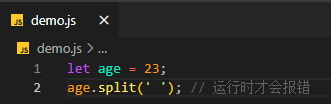
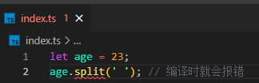

# TypeScript简介

- **TypeScript 是一种静态类型的编程语言**，它是 JavaScript 的超集，完全兼容 JavaScript，并在此基础上提供了强大的类型系统和其他功能，**TypeScript 的核心特性是静态类型检查** 

> **TypeScript 新增的内容**

- 类型检查
- 面向对象编程的特性，如类、接口、继承等
- 一套强大的开发工具和库，如声明文件(.d.ts)、 类型定义库(@types)等

> **TypeScript 的优点**

- 在编译阶段就能检测出潜在的类型错误，避免在运行时出现意外的错误
- 能帮助开发者更好地理解代码，提高代码的可读性和可维护性
- 能帮助开发者更好地进行代码补全、静态分析等工作
- 支持最新的 `ECMAScript` 标准，并在编译为 JavaScript 时可输出符合不同版本的目标环境代码

> **TypeScript 的缺点**

- **学习成本增加：**需要学习 TypeScript 的类型系统、声明文件以及其他一些特定的语法和工具 
- **项目体积增加：**TypeScript 会引入类型信息，并需编译为 JavaScript 才能在浏览器或执行环境中运行
- **类型定义维护：**使用第三方库或框架时，可能需要编写类型声明文件来描述库的类型信息，以便与 TypeScript 进行良好的集成
- **编译时间增加：**TypeScript 需要进行类型检查和编译步骤，频繁修改和重新编译会对开发速度产生影响

# 类型系统

> **按照「类型检查的时机」来分类，可分为动态类型和静态类型**

- **动态类型：**运行时才会进行类型检查，如**没有编译阶段的 `JavaScript`**

```javascript
let age = 23;
age.split(' '); // 运行时才会报错
```



- **静态类型：**编译阶段就会进行类型检查，如**需要编译的 `TypeScript `**

```typescript
let age = 23;
age.split(' '); // 编译时就会报错
```



> **按照「是否允许隐式类型转换」来分类，可分为强类型和弱类型**

- **弱类型：**存在**隐式类型转换**的问题，如 `JavaScript`

```javascript
// 运行时数字 1 会被隐式类型转换为字符串 '1'，加号 + 被识别为字符串拼接
console.log(1 + '1'); // '11'
```

- **强类型：**不会进行隐式类型转换，如 `Python`

```python
print(1 + '1') # 报错，int和str不能作求和操作
```

# 对比JavaScript

| TypeScript                                     | JavaScript                                 |
| ---------------------------------------------- | ------------------------------------------ |
| JavaScript的超集，用于解决大型项目的代码复杂性 | 一种脚本语言，用于创建动态网页             |
| 可以在编译期间发现并纠正错误                   | 作为一种解释型语言，只能在运行时发现错误   |
| 强类型，支持静态和动态类型                     | 弱类型，没有静态类型选项                   |
| 最终被编译成 JavaScript 代码，使浏览器可以理解 | 可以直接在浏览器中使用                     |
| 支持模块、泛型和接口                           | 不支持模块、泛型或接口                     |
| 支持 ES3，ES4，ES5 和 ES6+功能                 | 不支持编译其他 ES3，ES4，ES5 或 ES6+ 功能  |
| 社区的支持仍在增长，而且还不是很大             | 大量的社区支持以及大量文档和解决问题的支持 |

# 安装 TypeScript

- 使用命令行安装

```shell
npm i -g typescript
```

- 编译一个 `.ts` 文件，生成对应的 `.js` 文件

```shell
tsc index.ts
```

- 运行一个 `.ts` 文件

```shell
# 全局安装ts-node
npm i -g ts-node@8.6.5

# 运行ts文件
ts-node index.ts
```

- 如果在 `Vscode` 内权限不足，请参考以下文章修改权限：https://blog.csdn.net/qq_41336022/article/details/125162488
