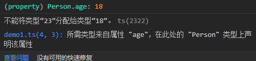
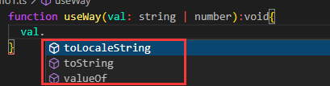
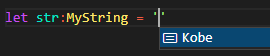
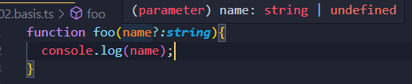
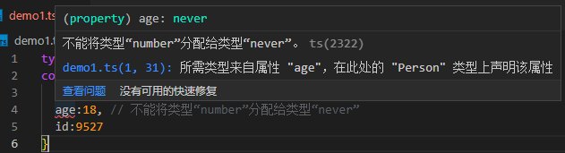
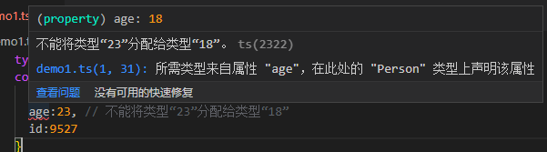
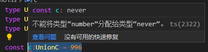
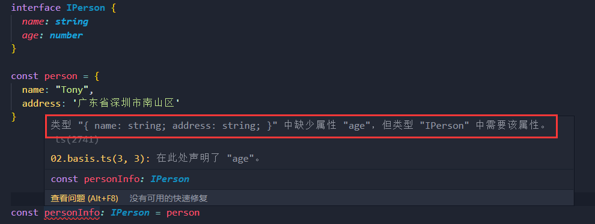

# 类型推论

- **解释：**指**编程语言中能够自动推导值的类型的能力**，它是一些**强静态类型语言的特性**

- 如果**没有明确的指定类型**，那么 `TypeScript` 会**依照类型推论的规则推断出一个类型**

```typescript
let num = 'seven';
num = 7; // 不能将类型“number”分配给类型“string”
```

> **注意：如果定义时没有赋值，不管之后有没有赋值，都会被推断成 `any` 类型，并完全不被类型检查**

```typescript
let myVal;
myVal = 7;
myVal = 'seven'
myVal = ():void => {}
```

# 类型别名

- **作用：**给一个类型起个新名字
- **用法：**使用 `type` 创建类型别名
- **应用：**常用于联合类型

```typescript
type MyString = string // MyString是string类型的别名
type MyFunc = () => string // MyFunc是返回string类型函数的别名
type GetString = MyString | MyFunc

function getData(val:GetString):GetString{
  return typeof val === 'string' ? val : val()
}
```

# 字面量类型

- 在 `TypeScript` 中，**字面量不仅可以表示值，还可以表示类型**
- 其中包括 **`3` 种字面量类型**：字符串字面量类型、数字字面量类型、布尔字面量类型

## 字符串字面量

- 字符串字面量类型其实就是**字符串常量**，**与字符串类型不同的是它是具体的值**

```typescript
type Name = 'Ts'
let name1:Name = 'typeScript' // 不能将类型“"typeScript"”分配给类型“"Ts"”
let name2:Name = 'Ts'
```

- **应用场景：**多个字面量类型组合成一个联合类型，用描述拥有明确成员的集合

```typescript
type Week = 'Mon'|'Tue'|"Wed"|'Thu'|'Fri'|'Sat'|'Sun'
function chooseDay(day:Week):void{
  console.log(day);
}
chooseDay('Mon') // 'Mon'
chooseDay('today') // 类型“"today"”的参数不能赋给类型“Week”的参数。
```

- 上面代码中，使用**四个字符串字面量类型组合成了一个联合类型**，这样可以将函数参数限定为更具体的类型
- **好处：**提升了代码的**可读性**，还保证了**函数参数类型**

## 数字字面量

- 数字字面量类型和字符串字面量类型差不多，都是**指定类型为具体的值**

```typescript
type Age = 18;
interface Person {
  name:string,
  age:Age
}

let p:Person = {
  name:'张三',
  age:23 // 不能将类型“23”分配给类型“18”
}
```



## 布尔字面量

- 布尔字面量和上面的两个类似

```typescript
type Success = true
let res:Success = true
let err:Success = false // 不能将类型“false”分配给类型“true”
```

- 由于布尔值只有 `true` 和 `false`，所以和 `boolean` 是一样的

```typescript
let result1:true | false;
let result2:boolean;
```

## 类型拓宽

- **理解：**字面量类型拓宽就是**将字面量类型转换为其父类型的设计**

- **示例：**用 `let` 和 `const`定义的变量的值相同时，变量的类型是怎么样的

  - **`const` 定义：**不定义类型时，推断**其类型为字面量类型**

  ```typescript
  const str = 'Lebron James' // 类型为'Lebron James'
  const num = 23 // 类型为23
  const flag = true // 类型为true
  ```

  - **`let` 定义：**不定义类型时，推断**其类型为赋值字面量类型的父类型**

  ```typescript
  let str = 'Lebron James' // 类型为string
  let num = 23 // 类型为number
  let flag = true // 类型为boolean
  ```

# 联合类型

- **含义：**多个类型的并集
- **作用：**表示变量、参数的类型不是某个单一类型，而是多种不同类型的组合

## 基本使用

- 联合类型**使用 `|` 分隔每个类型**

```typescript
let myVal: string | number;
myVal = 7;
myVal = 'seven'
myVal = true // 不能将类型“boolean”分配给类型“string | number”
```

- 上面代码中，`let myVal: string | number` 的意思是允许 `myVal` 的类型是 `string` 或者 `number`，但是赋予其他类型就会编译失败

## 访问属性或方法

- 当不确定联合类型的变量到底是哪个类型时，**只能访问此联合类型的共有属性或方法**

```typescript
function useWay(val: string | number):void{
  val.toString() // toString()方法是string和number共有的
}
```



- 当访问不是 `string` 和 `number` 的共有属性时会编译失败

```typescript
function useWay(val: string | number):number{
  return val.length
}
```


- 联合类型的变量**被赋值时会根据类型推论的规则推断出一个类型**

```typescript
let myVal: string | number;
myVal = 'Lebron James'
console.log(myVal.length); // 12
myVal = 1234
console.log(myVal.length); // 类型“number”上不存在属性“length”
```

- 上面代码中，当 `myVal` 被推断成了 `string`，访问它的 `length` 属性不会报错
- 当 `myVal` 被推断成了 `number`，访问它的 `length` 属性时编译报错

## 类型缩减

- 如果定义的**联合类型的包含原始类型和数字字面量类型**，最后**会缩减为原始类型**

```typescript
type MyNumber = 23 | number // 缩减为number类型
type MyString = 'Kobe' | string // 缩减为string类型
type MyBoolean = false | boolean // 缩减为boolean类型
```

- **问题：**编译器只能提示定义的变量是原始类型
- **解决：**给父类型添加 `"& {}"` 即可控制类型缩减，编译器会出现提示

```typescript
type MyString = 'Kobe' | string & {} 
```



- **注意：**当接口是联合类型时，并且**一个接口的属性是另一个接口属性的子集**，该属性也会类型缩减

```typescript
type MyInterface = { age: 18 } | { age: 18 | 25 } // age属性发生类型缩减，变成18 | 25
```

## 可选与联合

- 当函数参数是可选类型时，其本质上是 `类型|undefined` 的联合类型

```typescript
function foo(name?:string){
 console.log(name)
}
```

- 如上所示，此时形参 `name` 的类型是 `string|undefined`



- 调用函数时可以不传参数
- 但是如果写成 `string|undefined`而不是可选形式，则参数是必传的

```typescript
// 此时参数必须传递，否则编译不通过
function foo(name:string | undefined){
  console.log(name);
}
```

# 交叉类型

- **含义：**将多个类型合并为一个类型，即**多个类型的交集**
- **使用：**使用 `“&”` 操作符来声明交叉类型

```typescript
type crossType = string & number // 同时是string和number类型
```

- 像上面代码中，仅仅把原始类型、字面量类型等合并是无意义的，实际上就等于 `never`
- **使用场景①：**将多个接口类型合并成为一个类型

```typescript
type Person = { name: string } & { age: number } & { id: number }
const p:Person = {
  name:'张三',
  age:18,
  id:9527
}
```

- 两个接口中**同名属性定义了不同类型，合并后为 `never` 类型**

```typescript
type Person = { name: string, age: string } & { age: number } & { id: number }
const p:Person = {
  name:'张三',
  age:18, // 不能将类型“number”分配给类型“never”
  id:9527
}
```



- 两个接口中**同名属性，一个为原始类型，一个为字面量类型，合并后为两者中的子类型**

```typescript
type Person = { name: string, age: number } & { age:18 } & { id: number }
const p:Person = {
  name:'张三',
  age:23, // 不能将类型“23”分配给类型“18”
  id:9527
}
```



- **使用场景②：**将**多个联合类型合并成为一个交叉类型**，需要同时**满足不同的联合类型限制**

```typescript
type UnionA = "pink" | 996
type UnionB = 996 | 24
type UnionC = UnionA & UnionB
const c:UnionC = 996
```

- 如果多个联合类型中**没有相同的类型成员**，那么交叉出来的类型就是 `never` 类型

```typescript
type UnionA = "pink" | 996
type UnionB = false | 24
type UnionC = UnionA & UnionB
const c:UnionC = 996 // 不能将类型“number”分配给类型“never”
```



# 类型擦除

- `typescript` 在编译过程中批注的内容和接口会在运行时利用工具擦除

```typescript
interface IPerson {
  name: string
  age: number
}

const person = {
  name: "Tony",
  age: 18,
  address: '广东省深圳市南山区'
}

const personInfo: IPerson = person
```

- 如上面代码所示，常量 `person` 会进行类型推断，其中会有 `{address: string}`，当把 `person` 赋值给`personInfo` 时，编译器会把多余的属性进行**擦除(freshness)**，擦除后若依然满足 `IPerson` 接口规定的类型，则可以赋值

- 当擦除后不满足接口规定时，则不会通过编译

